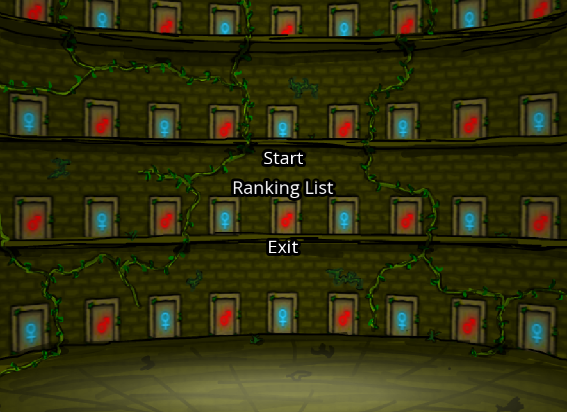
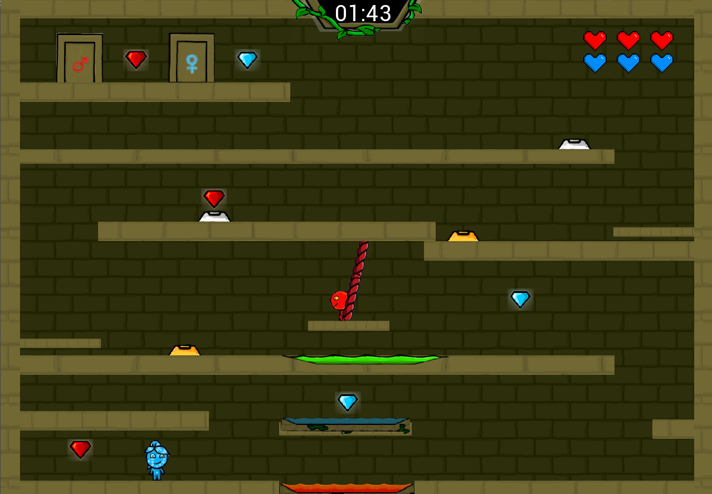
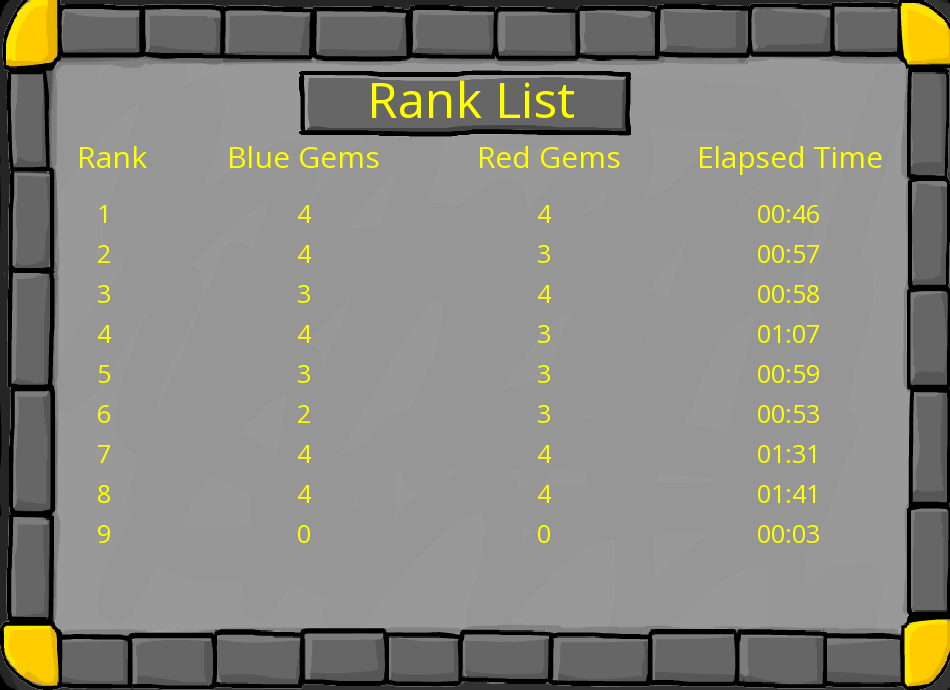

#  Fireboy and Watergirl – 2D Puzzle Platformer Clone

A cooperative 2D puzzle-platformer game inspired by *Fireboy and Watergirl*, developed in **C++** using the **SFML** graphics library. Players control two characters who must work together to solve level-based puzzles involving levers, doors, switches, and hazards.

##  Features

- Cooperative two-character control system
- Interactive puzzle elements: levers, switches, doors
- Realistic physics: gravity, damping, oscillation
- Real-time input handling and collision detection
- Clean, responsive gameplay loop
- One fully playable level
- In-game main menu and level completion ranking screen

## Screenshots

### 🧩 Main Menu


### 🎮 Gameplay Level


### 🏆 Ranking List


---

## Controls

| Key          | Action                      |
|--------------|-----------------------------|
| A / D        | Move Watergirl left/right   |
| W            | Watergirl jump              |
| Left / Right | Move Fireboy left/right     |
| Up Arrow     | Fireboy jump                |

---

## ⚙️ How to Run

1. **Clone the repository**:
   ```bash
   git clone https://github.com/tarek-moh/FireboyWatergirl.git
   cd fireboy-watergirl-clone
   
2. **Install SFML**
  Make sure SFML is installed on your system:

  Windows:
  Download and install SFML from https://www.sfml-dev.org/download.php, and configure your IDE (e.g., Visual Studio) to include the headers and link the libraries.

3. **Build the project**
   If using an IDE like Visual Studio, CLion, or Code::Blocks, make sure to:
    1-Include the SFML headers
    2-Link the following libraries:
   ```bash
   sfml-graphics
   sfml-window
   sfml-system
4. **Run the executable**
